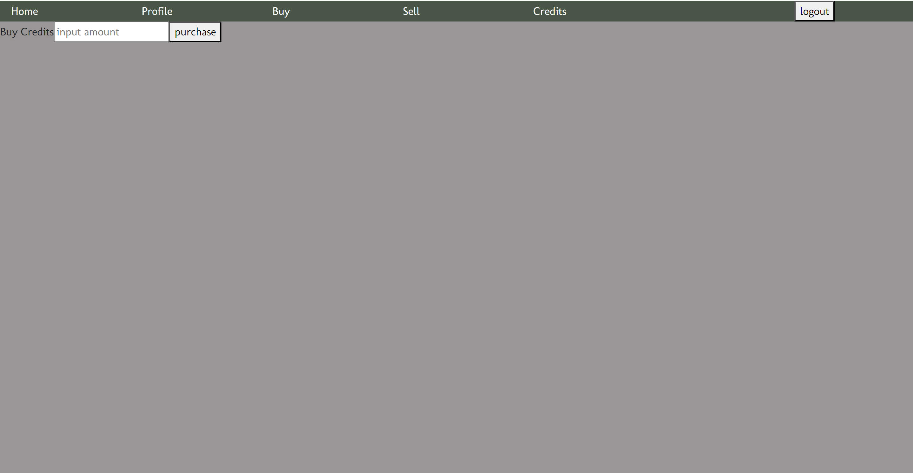

# Merch

Merch is an online marketplace that allows users to list items for sale and browse a diverse range of products offered by other users. Whether you're looking to sell your items or discover new ones, Merch provides a user-friendly platform to connect buyers and sellers.

## FEATURES

### Authentication

Logging into account will give a more personalised experience to the user

### User Profiles

Each registered user will have a profile page that include important contact information and can view their wallet credits. This page also has a transaction history to view the user's previous purchases and sales.

### Buy page

Users, both registered and unregistered are able to browse through a list of all items sold on the marketplace. The search bar also allows users to filter through specific items they are looking for. However, only registered users can purchase these items.

### Sell page

Registered users are able to create new listings to be put up for sale in other user's buy page. They are also able to update or delete any current listing here.

### Admin Controls

Admin accounts are authorised to delete any existing user accounts.

## Technologies Used

- PostgreSQL: For database management.
- Node.js: For server-side runtime environment.
- Express: For building the backend API.
- React.js: For building the user interface.
- Bootstrap: For responsive design and styling.
- Postman: For API testing and development.
- CSS: For styling
- Html: Structure and content
- https://pixabay.com/sound-effects

## .env variables

### Backend

- ACCESS_SECRET
- REFRESH_SECRET

### Frontend

- VITE_SERVER

## Future Developments

- allowing users to upload images to product listings using Cloudinary
- implement real time updates for any new listings using WebSockets

## Screenshots

### Login Page

### Profile Page

### Buy Page

### Sell Page

### Purchase Credits Page

